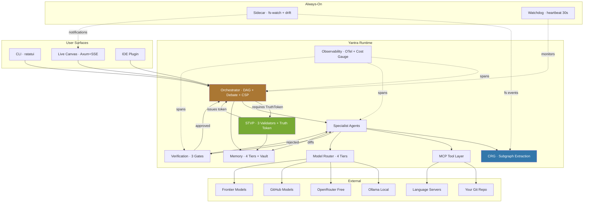
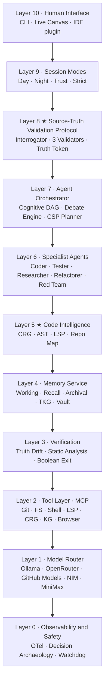
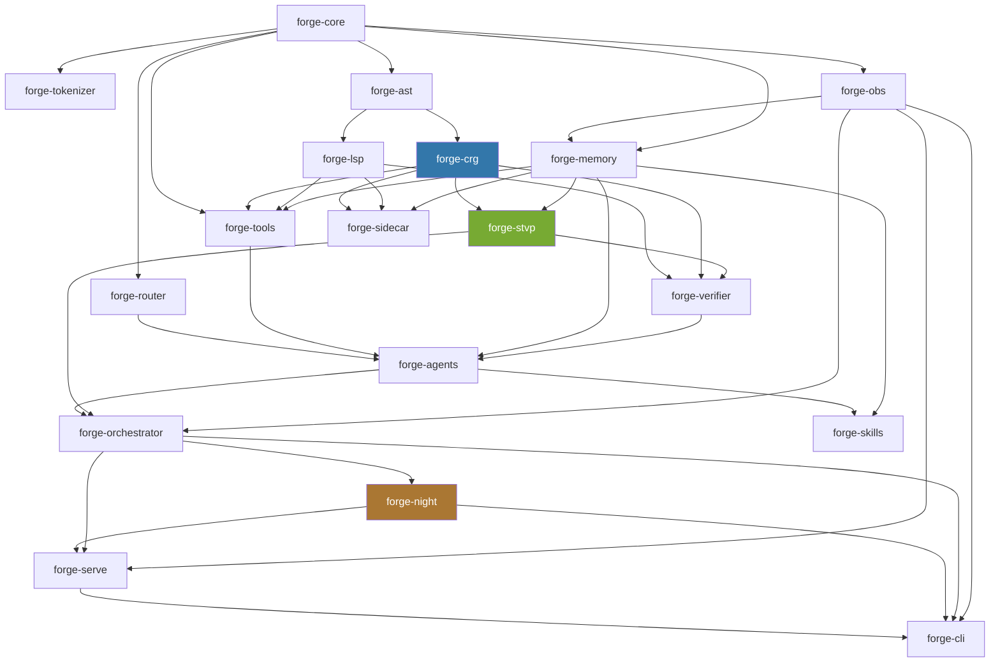
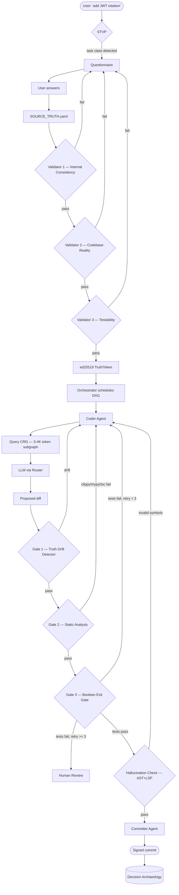
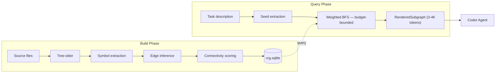
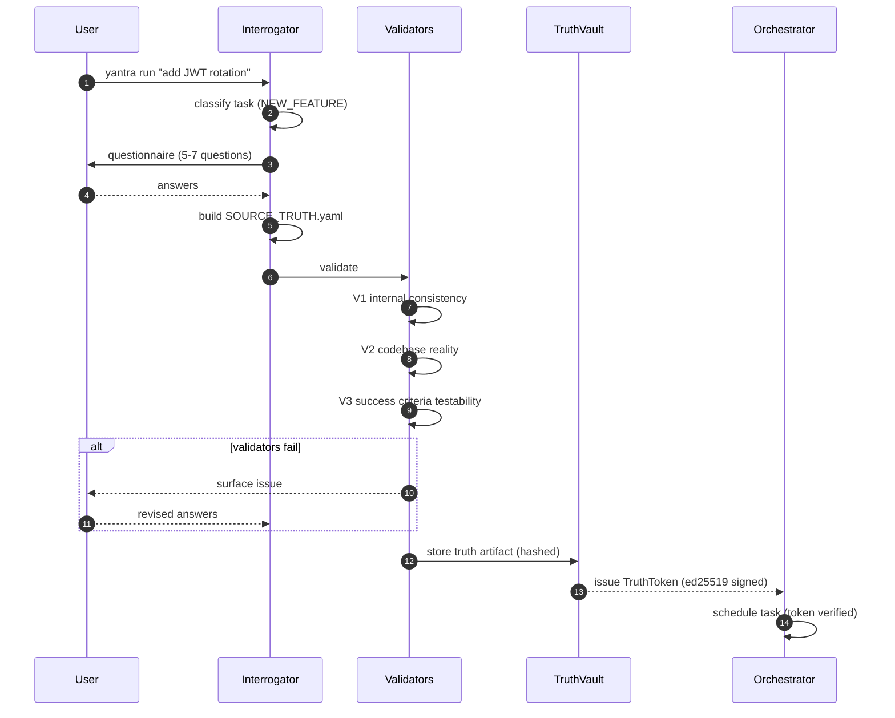
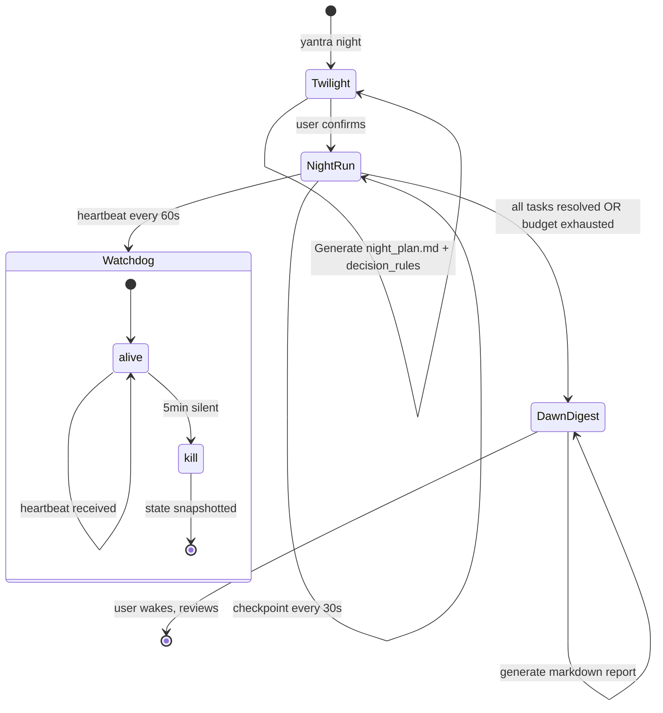

# Yantra (यन्त्र)

> **Engine. Instrument. Runtime.**
> A Rust-native agentic coding runtime by **Sankalp Systems**.

---

## What is Yantra?

Yantra is **not a wrapper around an LLM**. It is a fully autonomous coding *runtime* — a substrate that turns commodity language models into trustworthy, observable, autonomous engineers.

The core thesis:

> Models commoditize. Context retrieval, memory, planning, and verification do not. **The runtime is the moat.**

Yantra runs tasks end-to-end: from verifying your intent, through multi-agent code generation, through five independent verification gates, to a signed git commit — all with full observability and zero hallucinated symbols.

---

## The Three Load-Bearing Pillars

| ★ | Pillar | Purpose |
|---|---|---|
| ★ | **STVP** — Source-Truth Validation Protocol | Refuses to dispatch any task until the user's intent has been cryptographically verified |
| ★ | **CRG** — Code-Review Graph | Compresses 200K-token codebases to a 3–4K-token typed structural subgraph for agents |
| ★ | **Night Mode** | Front-loads all decisions at twilight, runs autonomously for 8+ hours, wakes you with a Dawn Digest |

If you wonder why any design decision was made, the answer is almost always one of these three.

---

## Quickstart

```bash
# Index your repo (builds crg.sqlite + embeddings)
cargo run --bin yantra -- index .

# Ask a question about the codebase
cargo run --bin yantra -- ask "What does the VerifierAgent do?"

# Run a task with full STVP verification
cargo run --bin yantra -- run "add JWT rotation"

# Start Night Mode (autonomous 8-hour run)
cargo run --bin yantra -- night
```

---

## System Architecture



---

## The 10-Layer Stack



| Layer | Crate(s) | Responsibility |
|---|---|---|
| L10 | `forge-cli`, `forge-serve` | Render state to humans; collect input |
| L9 | `forge-night` | Swap policy bundles (Day / Night / Trust / Strict) |
| L8 ★ | `forge-stvp` | Refuse tasks without verified source-truth |
| L7 | `forge-orchestrator` | Schedule a DAG of tasks across agents |
| L6 | `forge-agents` | Implement each specialist agent's loop |
| L5 ★ | `forge-crg`, `forge-ast`, `forge-lsp` | Structural code intelligence as queryable services |
| L4 | `forge-memory` | Persist everything across turns and sessions |
| L3 | `forge-verifier` | Reject diffs that fail truth/lint/test gates |
| L2 | `forge-tools` | Expose system capabilities as MCP servers |
| L1 | `forge-router` | Route LLM calls to the right tier with prompt translation |
| L0 | `forge-obs` | Make every action observable; enforce cost safety |

---

## Crate Map

```
crates/
├── forge-core/          Shared types: TaskId, TruthToken, AgentKind, WorkspaceMode
├── forge-tokenizer/     BPE tokenizer for token counting and budget enforcement
├── forge-obs/           OpenTelemetry, SQLite trace store, cost gauge, watchdog
├── forge-router/        ModelProvider trait + routing policy + prompt translator
├── forge-ast/           Tree-sitter wrapper, symbol extraction, DB persistence
├── forge-crg/      ★   Code-Review Graph: build, query, subgraph extraction
├── forge-lsp/           tower-lsp client, LSP-MCP bridge
├── forge-memory/        Working/Recall/Archival/TKG + Truth Vault + Mistake Library
├── forge-tools/         All MCP server implementations
├── forge-stvp/     ★   Source-Truth Validation Protocol
├── forge-verifier/      Boolean exit gate, static analysis, Truth Drift, hallucination
├── forge-agents/        All specialist agent implementations
├── forge-orchestrator/  DAG scheduler, Debate Engine, CSP Planner, Speculation
├── forge-night/    ★   Night Mode: Twilight, Night Run, Dawn Digest
├── forge-skills/        SKILL.md registry, skill-learning loop
├── forge-sidecar/       Always-on background daemon
├── forge-serve/         Axum HTTP + SSE Live Canvas
├── forge-cli/           clap + ratatui CLI entry point
├── forge-eval/          SWE-bench Verified subset runner
├── forge-swarm/         (Wave 2) QUIC-based distributed worker protocol
└── forge-federation/    (Wave 2) Cross-repo CRG meta-graph
```

---

## Module Dependency Graph



---

## A Task's Full Lifecycle



---

## The Five Verification Gates

Every diff that ships has cleared **five independent gates**. No coding agent on the market has all five.

| Gate | What it checks |
|---|---|
| **1. STVP TruthToken** | User's verified intent (ed25519-signed) |
| **2. Truth Drift Detector** | Diff didn't go outside the declared scope |
| **3. Static Analysis** | clippy / mypy / tsc report clean |
| **4. Boolean Exit Gate** | All tests pass |
| **5. AST + LSP Hallucination Check** | No symbols cited that don't exist in the repo |

---

## CRG — Code-Review Graph

The CRG is how Yantra sees your code. Instead of naively dumping files into a context window, it builds a typed structural graph of your entire codebase and extracts the minimum subgraph relevant to a given task.



**Token math:**

| Approach | Tokens | Cost |
|---|---|---|
| Naive whole-repo dump | ~210K | ~$0.40/task |
| Aider repo-map + N round-trips | 1K + 5×10K | ~$0.12/task |
| **Yantra CRG subgraph** | **3–4K, no round-trips** | **~$0.01/task** |

**Edge types stored:**

| Type | Meaning |
|---|---|
| `CALLS` | Function calls another |
| `IMPORTS` | File imports module |
| `IMPLEMENTS` | Struct implements trait |
| `TESTS` | Test function covers symbol |

---

## STVP — Source-Truth Validation Protocol



**Three strictness modes:**

| Mode | When | Validators | Questionnaire |
|---|---|---|---|
| `Strict` | NEW_FEATURE, MIGRATION, INTEGRATION | All 3 | Full (5–7 questions) |
| `Light` | BUG_FIX, REFACTOR | V2 only | Essentials (3 questions) |
| `Trust` | chore, docstring, style | None | None |

---

## Night Mode



**Night Mode cost target (8-hour session, ~50 tasks):**

| Strategy | Cost |
|---|---|
| Naive frontier-only | ~$50 |
| **Yantra (Tier 0/1 + CRG + KV cache)** | **< $2** |

---

## Storage Architecture

All storage is SQLite (WAL mode). Zero setup, embedded, single-file, offline-capable.

```
.yantra/                    ← gitignored, per-project
├── crg.sqlite              symbols + edges + embeddings
├── memory.sqlite           recall + archival + TKG + vault
├── decisions.sqlite        archaeology + event bus log
├── traces.sqlite           OTel spans + cost ledger
├── genome.json             repo dialect profile
├── sacred.txt              user-defined sacred patterns
└── source_truth/           versioned SOURCE_TRUTH.yaml artifacts
```

---

## Model Routing

Yantra routes LLM calls across four tiers. The model is never hard-coded — all calls go through the `ModelProvider` trait.

| Tier | Providers | Used for |
|---|---|---|
| **0** | Ollama (local) | ~60% of all calls — free, offline |
| **1** | OpenRouter free, GitHub Models | Routine generation |
| **2** | Low-cost hosted | Complex multi-step reasoning |
| **3** | Frontier (GPT-4o, Claude, Gemini) | Architecture, debate synthesis, sacred-file decisions only |

---

## Key Technology Stack

| Layer | Technology |
|---|---|
| Language | Rust (stable, pinned in `rust-toolchain.toml`) |
| Async runtime | Tokio |
| Graph storage | SQLite (WAL) via `rusqlite` |
| Code parsing | Tree-sitter (Rust, Python, TypeScript, JavaScript) |
| Embeddings | `fastembed` (local, no API needed) |
| HTTP client | `reqwest` (async-only) |
| CLI | `clap` + `ratatui` |
| HTTP server | Axum + SSE |
| Observability | OpenTelemetry (`tracing` + `tracing-subscriber`) |
| Ed25519 signing | `ring` |
| Error handling | `thiserror` (libraries) + `anyhow` (binaries) |
| Git | `gitoxide` (no subprocess shelling) |
| Testing | `cargo-nextest` + `proptest` |

---

## Build & Dev Commands

```bash
# First-time setup
./scripts/setup-dev.sh               # Ollama, models, SQLite setup

# Day-to-day
cargo fmt                            # auto-format
cargo lint                           # clippy, warnings-as-errors
cargo lint-fix                       # auto-fix machine-applicable lints
cargo test-all                       # all tests via nextest
cargo doc-check                      # rustdoc with warnings-as-errors
cargo build                          # compile everything

# Yantra CLI
cargo run --bin yantra -- index .          # build CRG for current directory
cargo run --bin yantra -- ask "..."        # ask the codebase a question
cargo run --bin yantra -- run "..."        # run a task with full STVP
cargo run --bin yantra -- night            # start Night Mode

# Single-crate
cargo test -p yantra-crg
cargo bench -p yantra-crg
```

---

## Performance Targets

| Operation | p50 | p99 |
|---|---|---|
| CRG subgraph extract | 20ms | 50ms |
| AST re-parse on file save | 30ms | 150ms |
| Truth Drift Detector | 30ms | 50ms |
| Tool call: FS read | 5ms | 20ms |
| Tool call: LSP get_definition | 80ms | 300ms |
| Tier-0 model call (Ollama) | 400ms | 1.2s |
| Tier-1 model call | 1s | 3s |
| Tier-3 model call (frontier) | 2.5s | 8s |
| Decision Archaeology write | 2ms | 10ms |

**Memory footprint (100K LoC project):**

| Component | Resident |
|---|---|
| Yantra runtime (no Ollama) | < 500 MB |
| Sidecar daemon | < 50 MB |
| Watchdog process | < 10 MB |

---

## Changes Made in This Session

### Bug Fix — `FOREIGN KEY constraint failed` on `yantra index`

**Root cause:** Files with zero extracted symbols (e.g. files that parse correctly but contain only imports or macro expansions) never got a row in the `files` table. Their imports still referenced `file_id`, violating the SQLite FK constraint and crashing the entire indexer.

**Fix:** Added `insert_file()` to `forge-ast/src/db.rs`. Both `build_from_repo` and `update_file` in `forge-crg/src/builder.rs` now call `insert_file` *immediately after a successful parse*, before any symbol/import/call-site insertion. The file row is guaranteed to exist before any child record references it.

**Files changed:**
- [`crates/forge-ast/src/db.rs`](crates/forge-ast/src/db.rs) — new `insert_file()` public function
- [`crates/forge-ast/src/lib.rs`](crates/forge-ast/src/lib.rs) — re-exported `insert_file`
- [`crates/forge-crg/src/builder.rs`](crates/forge-crg/src/builder.rs) — `build_from_repo` and `update_file` now call `insert_file` before symbol/import loops

**Verification:**
```
cargo run --bin yantra -- index .
→ Successfully indexed 1153 symbols.

cargo test-all
→ 328 tests run: 328 passed, 0 skipped

cargo lint   → clean (0 warnings)
cargo doc-check → clean (0 warnings)
```

### Bug Fix — `yantra ask` Cross-Role Hallucination

When asking about a runtime agent (e.g. `VerifierAgent`), the CRG semantic search pulled in both `forge-agents` (Runtime) and `forge-stvp` (PreFlight) symbols. Without lifecycle boundary context the model conflated the two roles.

**Fixes:**
- **Module-Boundary Manifest** appended to CRG subgraph output (`forge-crg/src/subgraph.rs`) — tags each symbol with its crate and lifecycle phase (`PreFlight` / `Runtime` / `Observability` / `Persistence`)
- **Phase 1.5 Lifecycle Boundary Check** added to `ask.md` prompt — model must explicitly group symbols by phase before answering
- **Cross-Crate Conflation Detector** added to `ask_verifier.rs` — heuristic check that prints `⚠ Cross-Role Warning` when Runtime and PreFlight keywords are conflated

### Bug Fix — Multi-Agent DAG Greenfield Mode Gap

In empty workspaces, the multi-agent DAG path never checked `is_greenfield_workspace()` — it always ran the Coder in Incremental Mode. With an empty CRG subgraph, the Coder's safety guardrail fired and the pipeline died.

**Fixes:**
- `WorkspaceMode` enum (`Greenfield` / `Incremental`) with `detect()` added to `forge-core`
- `workspace_mode` field added to `AgentContext` and propagated through the scheduler
- `CoderAgent::run()` branches its prompt on `context.workspace_mode`
- `coder.md` prompt updated with explicit Greenfield override for the safety guardrail

---

## Repository Layout

```
yantra/
├── Cargo.toml              workspace manifest
├── Cargo.lock
├── rust-toolchain.toml     pinned Rust version
├── rustfmt.toml
├── clippy.toml
├── AGENTS.md               AI assistant protocol (read before writing code)
├── ARCHITECTURE.md         full system diagram + spec
├── README.md               ← this file
├── crates/                 all library and binary crates
├── configs/                routing.toml, agents.toml, memory.toml
├── skills/                 Git-backed SKILL.md registry
├── tests/                  cross-crate integration tests
├── benches/                criterion benchmarks
├── docs/                   deep-dive docs + ADRs
├── examples/               example invocations
├── scripts/                dev tooling
├── .github/workflows/      CI/CD (ci.yml, release.yml, nightly.yml)
└── .yantra/                runtime data (gitignored)
```

---

## Sacred Files

Files matching patterns in `.yantra/sacred.txt` require explicit STVP `sacred_authorization` before any modification. Default sacred patterns include `src/auth/**`, `src/payments/**`, `src/crypto/**`, `configs/**`, and the workspace-level `Cargo.toml`. No exceptions, no "small change" bypasses.

---

## License

Apache-2.0 · [Sankalp Systems](https://sankalp.systems) · 2026
